# Báo Cáo TV2 - CI/CD Pipelines Với Jenkins

## 1. Tóm Tắt Phần Việc

TV2 phụ trách xây dựng pipeline CI/CD cho repo YAS: kiểm tra code, build/test service thay đổi, build/push Docker image, cập nhật GitOps repo và hỗ trợ developer-build.

Viết 1 đoạn 5-8 câu:

- Pipeline chạy từ GitHub webhook/Jenkins Multibranch.
- Monorepo detection giúp chỉ build service liên quan.
- Docker image được push lên Docker Hub `bingsu1103`.
- Jenkins update `gitops-manifest-k8s` để ArgoCD tự deploy.
- `developer_build` cho phép test branch/service riêng.

## 2. Scope Pipeline Hiện Tại

Pipeline hiện phục vụ 16 workload ứng dụng:

```text
product
cart
order
customer
inventory
tax
payment
media
search
location
storefront-bff
storefront-ui
backoffice-bff
backoffice-ui
swagger-ui
sampledata
```

Mapping source/image quan trọng:

| Workload | Source/image |
|----------|--------------|
| `storefront-ui` | source `storefront/`, image `bingsu1103/storefront:<tag>` |
| `backoffice-ui` | source `backoffice/`, image `bingsu1103/backoffice:<tag>` |
| `swagger-ui` | image public `swaggerapi/swagger-ui`, không build riêng |
| `kafka-connect` | image public `quay.io/debezium/connect:2.4`, không build trong Jenkins YAS |

Ngoài scope pipeline hiện tại:

```text
promotion
rating
delivery
recommendation
webhook
payment-paypal
```

## 3. Jenkins Configuration

Screenshot cần chèn:

```markdown
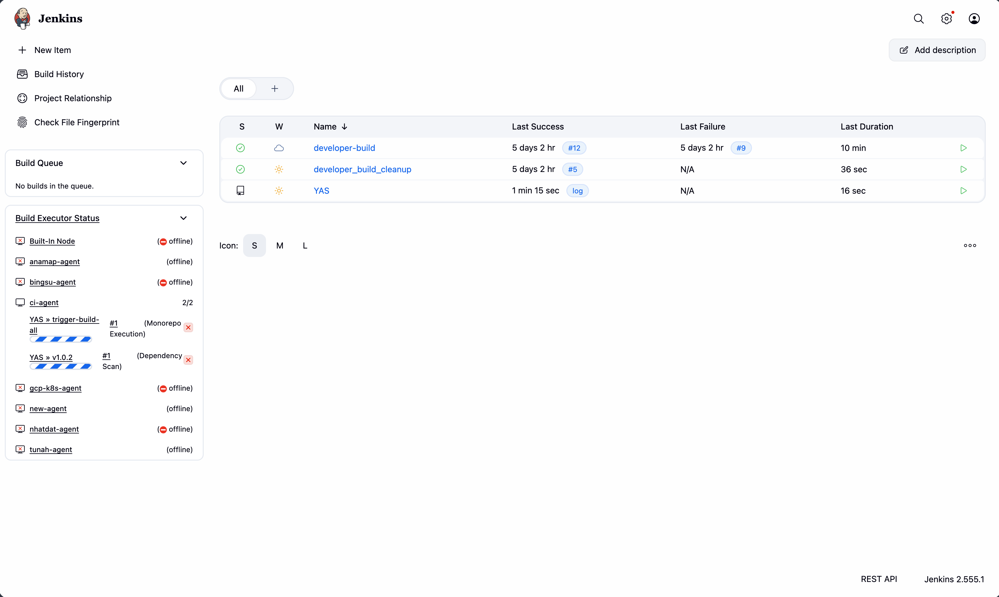
Caption: Jenkins dashboard hiển thị các job CI/CD của đồ án.
```

```markdown
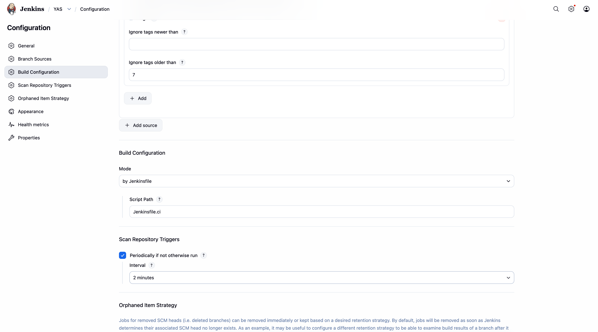
Caption: Multibranch Pipeline trỏ tới repo YAS và sử dụng Jenkinsfile.ci.
```

```markdown
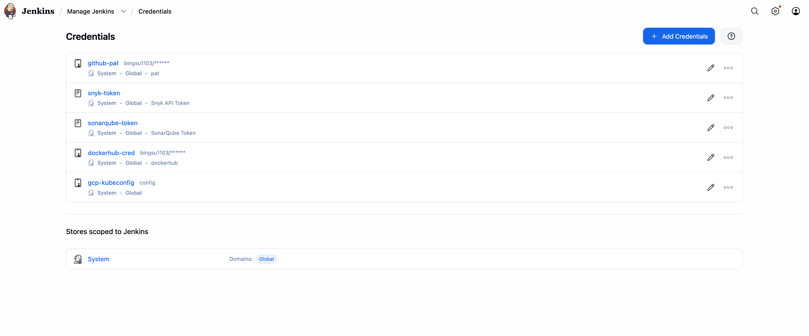
Caption: Các credentials cần thiết gồm Docker Hub, GitHub token và kubeconfig.
```

Nội dung viết:

- Jenkins agent label.
- Credentials dùng trong pipeline.
- Webhook hoặc branch scan trigger.

## 4. CI Pipeline

Mô tả các stage:

1. Pre-check.
2. Check Skip/docs-only.
3. Secret Scanning.
4. Monorepo Execution.
5. Code Quality/Quality Gate.
6. Coverage Report.
7. Dependency Scan.
8. Docker Build & Push.
9. Update GitOps Dev/Staging.

Screenshot cần chèn:

```markdown
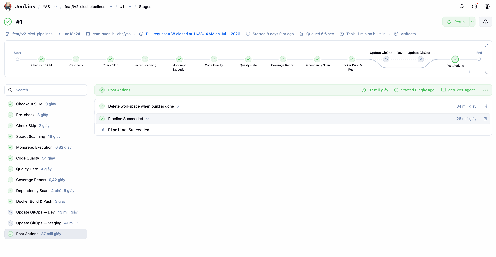
Caption: Jenkins pipeline chạy các stage CI/CD chính.
```

```markdown
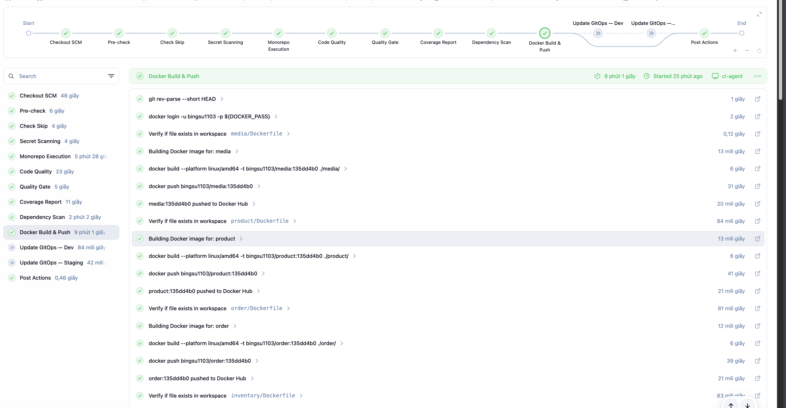
Caption: Console output cho thấy service được detect, build và push image.
```

Lệnh kiểm chứng trong repo YAS:

```bash
grep -nE "backendServices|dockerServices|location|storefront|backoffice" Jenkinsfile.ci
```

## 5. Docker Build Và Push

Nội dung viết:

- Tag theo short commit.
- Main branch có thêm `latest`.
- Release tag có dạng `vX.Y.Z`.
- UI image dùng `storefront` và `backoffice`.

Screenshot cần chèn:

```markdown

Caption: Docker Hub hiển thị image tag của service product.
```

```markdown

Caption: Docker Hub hiển thị image tag của service location, service được bổ sung vào scope hiện tại.
```

```markdown

Caption: Docker Hub hiển thị image storefront/backoffice dùng cho UI workloads.
```

## 6. GitOps Update Và ArgoCD Deploy

Mô tả flow:

```text
Jenkins build/push image
  -> scripts/update-gitops-manifest.sh
  -> commit vào gitops-manifest-k8s
  -> ArgoCD detect
  -> rollout namespace dev/staging
```

Screenshot cần chèn:

```markdown
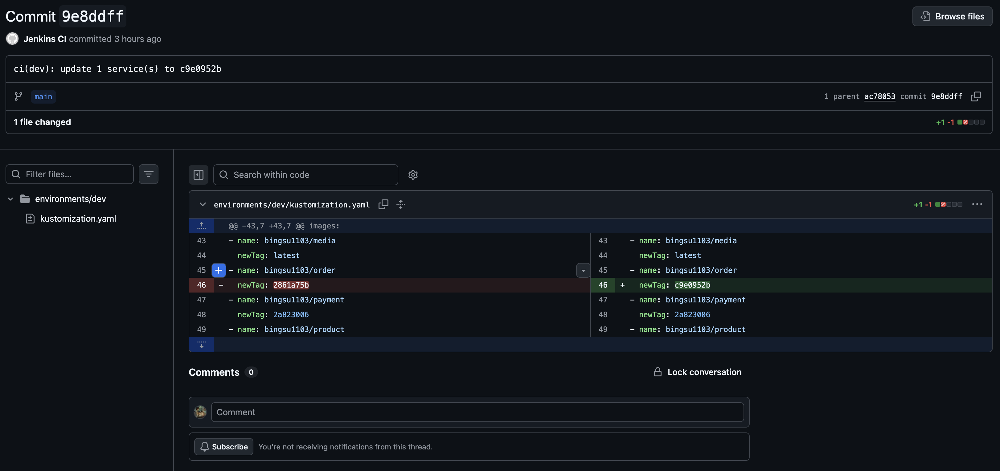
Caption: Commit do Jenkins tạo trong repo gitops-manifest-k8s để cập nhật image tag.
```

```markdown
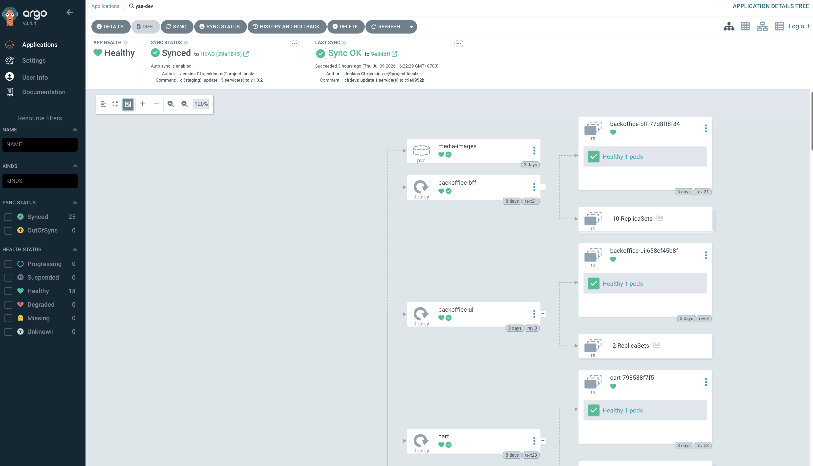
Caption: ArgoCD yas-dev sau GitOps update; nếu đang Progressing thì chờ rollout hoàn tất rồi chụp.
```

Lệnh kiểm chứng:

```bash
kubectl get application yas-dev yas-staging -n argocd -o wide
kubectl get deploy -n dev -o jsonpath='{range .items[*]}{.metadata.name}{" -> "}{.spec.template.spec.containers[0].image}{"\n"}{end}' | sort
```

## 7. Developer Build

Nội dung viết:

- Job cho phép chọn branch/tag cho từng service.
- Namespace `developer-build` có NodePort Service.
- Deployment mặc định có thể scale `0/0` để tiết kiệm tài nguyên.

Screenshot cần chèn:

```markdown
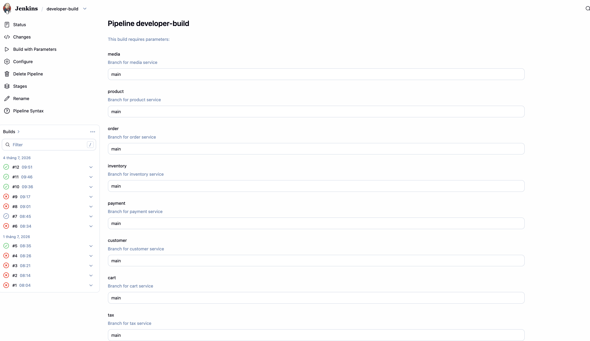
Caption: Job developer_build cho phép chọn branch cho từng workload trong scope.
```

```markdown
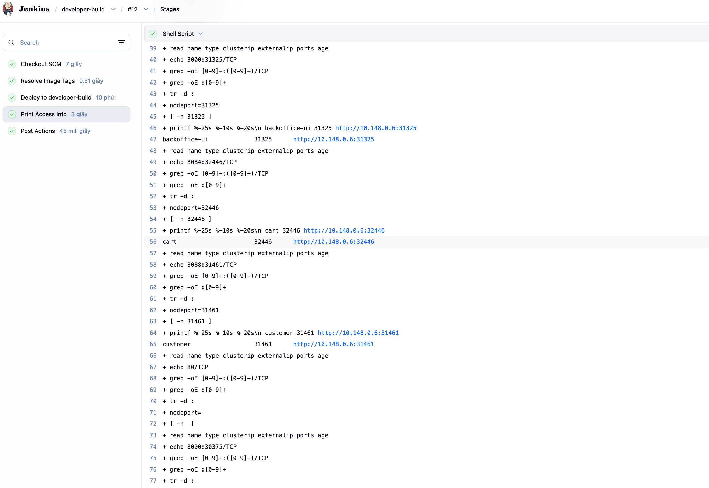
Caption: Console output in ra NodePort để developer truy cập service test.
```

Lệnh kiểm chứng:

```bash
kubectl get deploy,svc -n developer-build
```

## 8. Cleanup Job

Screenshot cần chèn:

```markdown
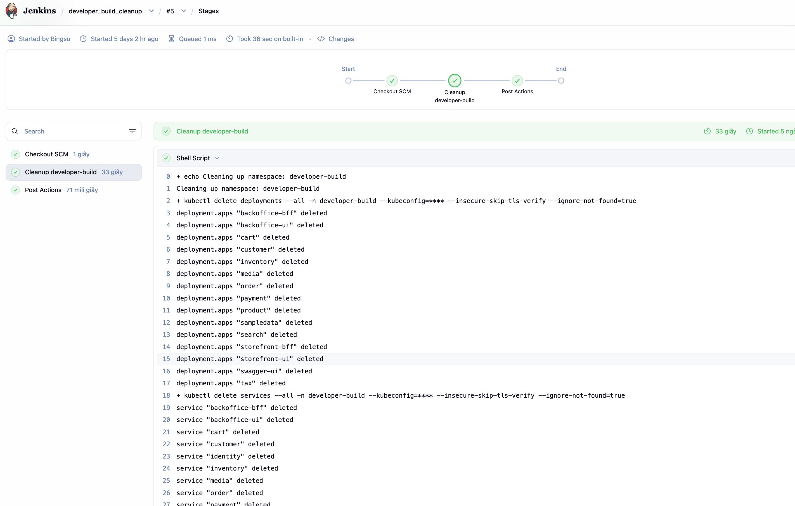
Caption: Cleanup job scale down hoặc dọn workload trong namespace developer-build.
```

```markdown
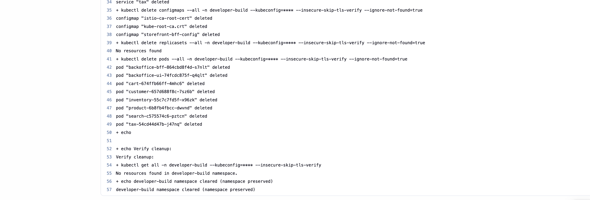
Caption: Namespace developer-build sau cleanup, deployment không còn chạy pod test.
```

## 9. Sự Cố Và Cách Xử Lý

Gợi ý viết:

- Lỗi diff trên main branch khi `merge-base == HEAD`, đã xử lý bằng fallback `HEAD~1..HEAD`.
- Service UI không build từ chart name mà dùng source `storefront/` và `backoffice/`.
- `swagger-ui` và `kafka-connect` dùng image public, không build từ repo YAS.

## 10. Kết Luận

Kết luận cần nêu:

- Pipeline hỗ trợ scope hiện tại.
- Image được build/push.
- GitOps update hoạt động.
- ArgoCD rollout thành công.
- Developer-build hỗ trợ test branch/service riêng.
