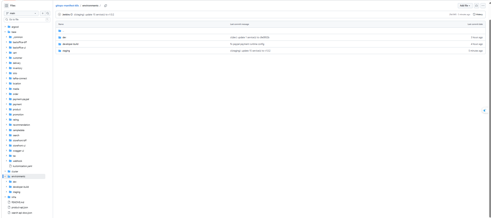
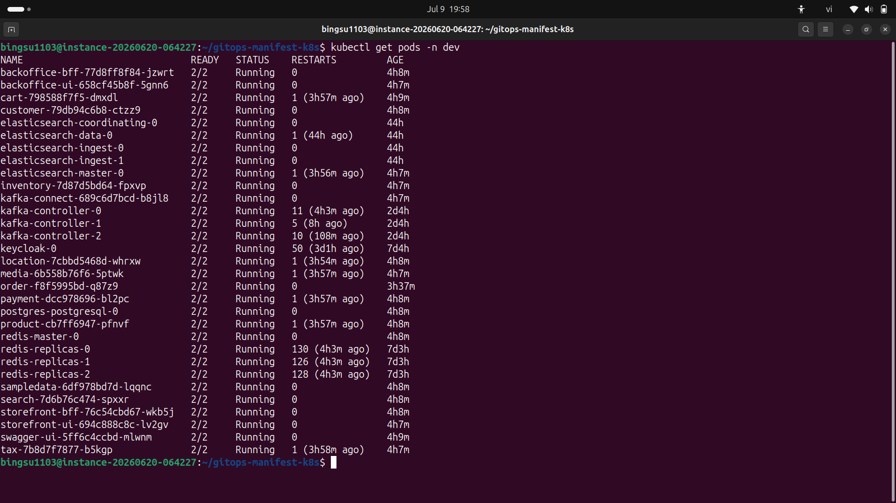
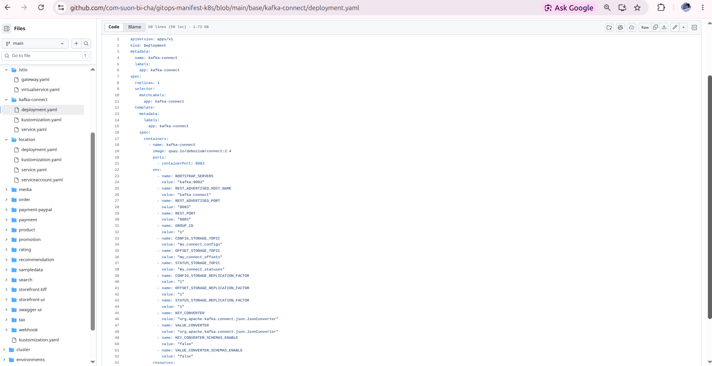
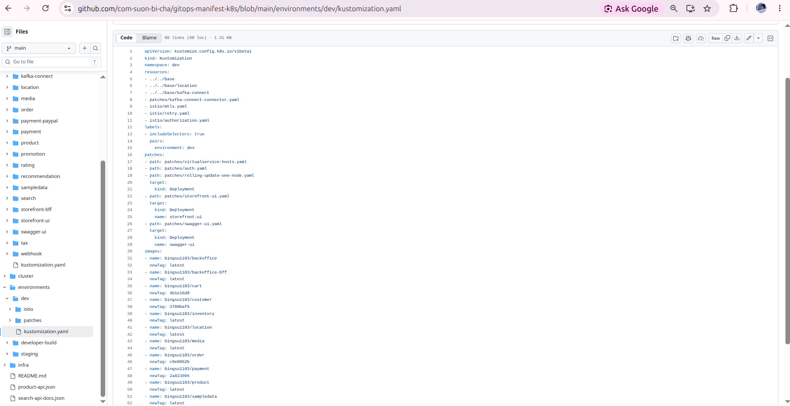
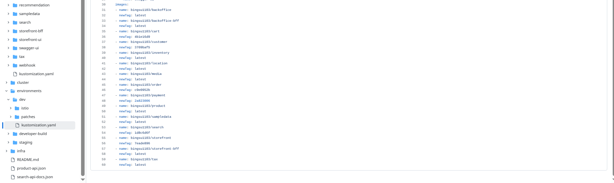
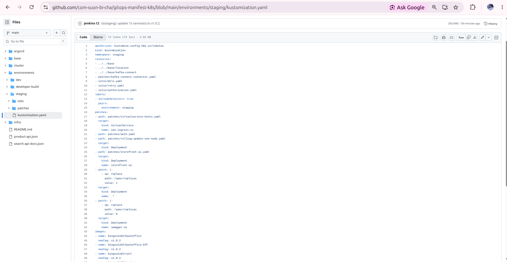
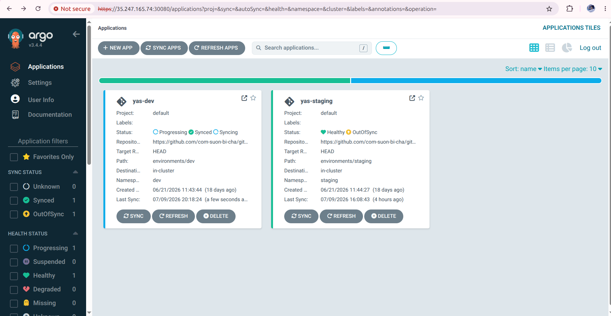
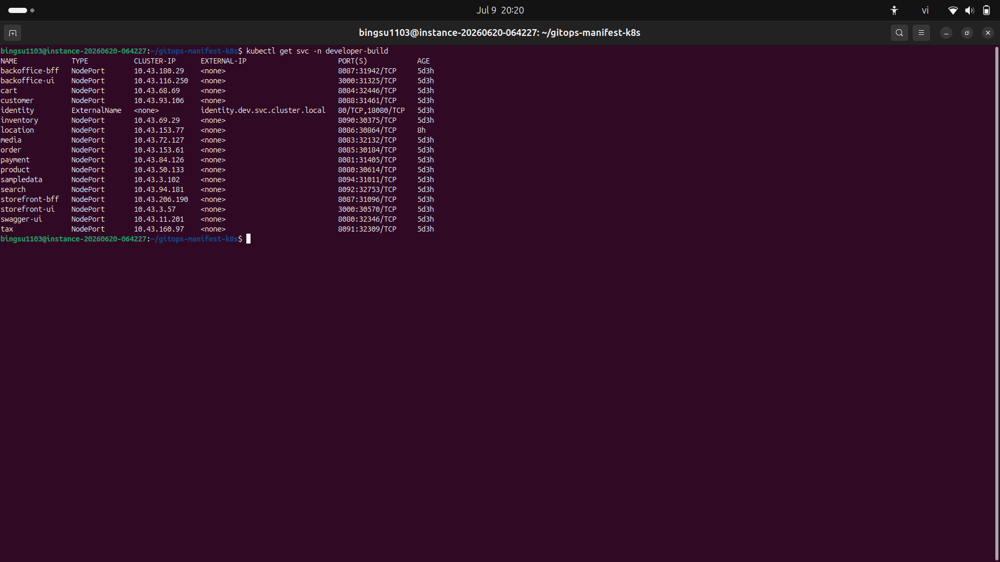
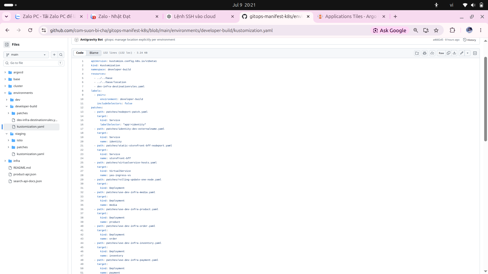
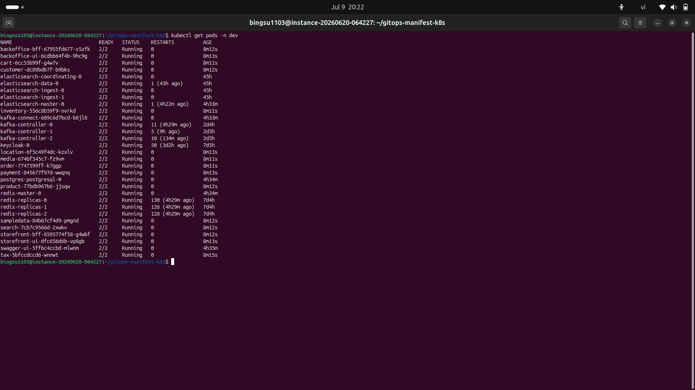

# Báo Cáo TV3 - GitOps Manifests Và Kustomize

## 1. Tóm Tắt Phần Việc

TV3 phụ trách xây dựng và duy trì repo `gitops-manifest-k8s`, nơi ArgoCD lấy desired state để deploy hệ thống YAS.

Viết 1 đoạn 5-8 câu:

- Vì sao tách GitOps repo khỏi source repo YAS.
- Kustomize base/overlay được tổ chức thế nào.
- `dev`, `staging`, `developer-build` khác nhau ra sao.
- Scope hiện tại đã mở rộng thêm `location` và `kafka-connect`.
- ArgoCD sync manifest như thế nào.

## 2. Cấu Trúc GitOps Repo

Screenshot cần chèn:

```markdown

Caption: Cấu trúc repo gitops-manifest-k8s gồm base và các environment overlays.
```

Lệnh gợi ý:

```bash
find base environments -maxdepth 3 -type f | sort
```

Nội dung viết:

- `base/` chứa manifest dùng chung.
- `environments/dev/` chứa patch/tag cho dev và Istio policy.
- `environments/staging/` chứa patch/tag cho staging.
- `environments/developer-build/` chứa NodePort và patch dùng infra ở `dev`.

## 3. Scope Render Hiện Tại

### Dev/Staging

Render ra 17 Deployment:

- 16 workload ứng dụng:
  `product`, `cart`, `order`, `customer`, `inventory`, `tax`, `payment`, `media`, `search`, `location`, `storefront-bff`, `storefront-ui`, `backoffice-bff`, `backoffice-ui`, `swagger-ui`, `sampledata`.
- 1 workload hỗ trợ:
  `kafka-connect`.

Ngoài scope:

```text
promotion
rating
delivery
recommendation
webhook
payment-paypal
```

Screenshot cần chèn:

```markdown

Caption: Kustomize render của dev hiển thị 16 workload ứng dụng và kafka-connect.
```

Lệnh kiểm chứng:

```bash
kubectl kustomize environments/dev > /tmp/yas-dev-rendered.yaml
awk '/^kind: Deployment$/{in_dep=1; next} in_dep && /^metadata:/{next} in_dep && /^  name: /{sub(/^  name: /,""); print; in_dep=0}' /tmp/yas-dev-rendered.yaml | sort
grep -nE 'name: (promotion|rating|delivery|recommendation|webhook|payment-paypal)$' /tmp/yas-dev-rendered.yaml || true
```

## 4. Base Manifests

Nội dung viết:

- Mỗi workload có Deployment, Service, ServiceAccount.
- `serviceAccountName` trùng tên service để TV4 dùng AuthorizationPolicy.
- `location` được quản lý trong `base/location`.
- `kafka-connect` được quản lý trong `base/kafka-connect`.

Screenshot cần chèn:

```markdown

Caption: Manifest location được bổ sung vào GitOps để phục vụ dependency thực tế.
```

```markdown

Caption: Manifest kafka-connect phục vụ Debezium/CDC trong dev và staging.
```

## 5. Dev Overlay

Nội dung viết:

- Include `../../base`, `../../base/location`, `../../base/kafka-connect`.
- Include `patches/kafka-connect-connector.yaml`.
- Include `istio/mtls.yaml`, `istio/retry.yaml`, `istio/authorization.yaml`.
- Quản lý image tags cho dev.

Screenshot cần chèn:

```markdown

Caption: Overlay dev include workload, kafka-connect và cấu hình Istio.
```

```markdown

Caption: Image tags trong environments/dev/kustomization.yaml được Jenkins cập nhật.
```

## 6. Staging Overlay

Nội dung viết:

- Staging render cùng scope workload với dev.
- Staging hiện có ingress Gateway/VirtualService.
- Staging chưa bật đầy đủ mTLS/Authz/retry như dev.

Screenshot cần chèn:

```markdown

Caption: Overlay staging quản lý cùng scope workload với dev.
```

```markdown

Caption: ArgoCD yas-staging ở trạng thái Synced/Healthy tại thời điểm chụp.
```

## 7. Developer-Build Overlay

Nội dung viết:

- NodePort Service cho developer truy cập.
- Identity dùng ExternalName về `dev`.
- Workload có thể scale `0/0` khi không test.
- Dùng patch để trỏ infra sang `dev`.

Screenshot cần chèn:

```markdown

Caption: Namespace developer-build có NodePort Service cho các workload trong scope.
```

```markdown

Caption: Overlay developer-build patch service type và cấu hình dùng infra dev.
```

## 8. ArgoCD Sync

Lệnh kiểm chứng:

```bash
kubectl get application yas-dev yas-staging -n argocd -o wide
kubectl get deploy,svc,sa -n dev
```

Screenshot cần chèn:

```markdown

Caption: ArgoCD yas-dev đồng bộ desired state từ gitops-manifest-k8s.
```

```markdown

Caption: Workload trong namespace dev đang Running theo scope GitOps hiện tại.
```

## 9. Sự Cố Và Cách Xử Lý

Gợi ý viết:

- Scope ban đầu 15 workload, sau đó bổ sung `location`.
- Thêm `kafka-connect` như workload hỗ trợ CDC.
- Cần tránh để tài liệu cũ 19 service gây nhầm với scope deploy hiện tại.
- `developer-build` có thể còn ServiceAccount cũ ngoài scope; cần phân biệt leftover resource với workload đang chạy.

## 10. Kết Luận

Kết luận cần nêu:

- GitOps repo là source of truth deploy.
- `dev` và `staging` được ArgoCD quản lý; cần chụp khi rollout hiện tại đã ổn định.
- Scope hiện tại đã phản ánh đúng nhu cầu demo.
- Kustomize hỗ trợ tách base và environment rõ ràng.
