# Báo Cáo TV4 - Istio Service Mesh, Security Và Kiali

## 1. Tóm Tắt Phần Việc

TV4 phụ trách triển khai và kiểm chứng Service Mesh cho YAS bằng Istio. Nội dung gồm ingress routing, mTLS, AuthorizationPolicy, retry policy, Kiali visualization và tổng hợp bằng chứng.

Viết 1 đoạn 5-8 câu:

- Istio giúp kiểm soát traffic service-to-service.
- `dev` là môi trường bật đầy đủ mTLS/Authz/retry.
- `staging` hiện mới có ingress Gateway/VirtualService.
- AuthorizationPolicy dựa trên ServiceAccount.
- Kiali dùng để quan sát topology và mTLS.

## 2. Cấu Hình Istio Trong GitOps Và Kiali

Nội dung viết:

- `base/istio/gateway.yaml`: tạo `yas-gateway`.
- `base/istio/virtualservice.yaml`: route ingress cho storefront, backoffice, identity, swagger và BFF.
- `environments/dev/istio/mtls.yaml`: mTLS STRICT và DestinationRule.
- `environments/dev/istio/retry.yaml`: retry policy.
- `environments/dev/istio/authorization.yaml`: AuthorizationPolicy.

Screenshot đã có:

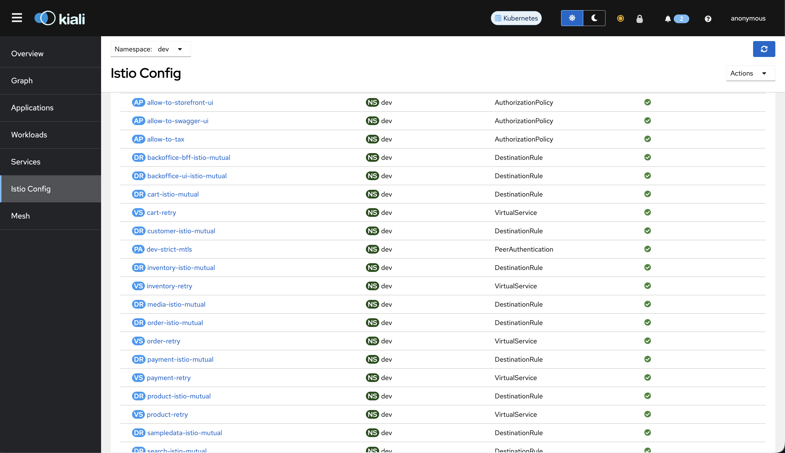

Caption: Kiali Istio Config trong namespace `dev` hiển thị các resource đại diện gồm `AuthorizationPolicy`, `DestinationRule`, `PeerAuthentication` và `VirtualService` đều hợp lệ, chứng minh cấu hình Istio đã được apply vào cluster.

## 3. Istio System Và Sidecar

Lệnh kiểm chứng:

```bash
kubectl get pods -n istio-system
kubectl get ns dev staging developer-build --show-labels
kubectl get pods -n dev
```

Screenshot đã có:

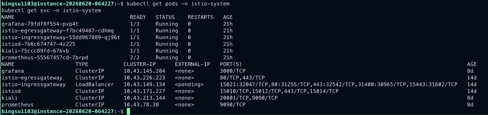

Caption: Các thành phần Istio, Kiali, Prometheus và Grafana trong namespace `istio-system` đang Running và service tương ứng đã được tạo.

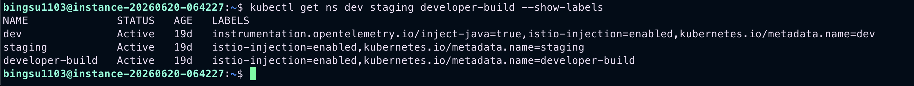

Caption: Các namespace `dev`, `staging` và `developer-build` có label `istio-injection=enabled`, cho phép Istio tự động inject sidecar.

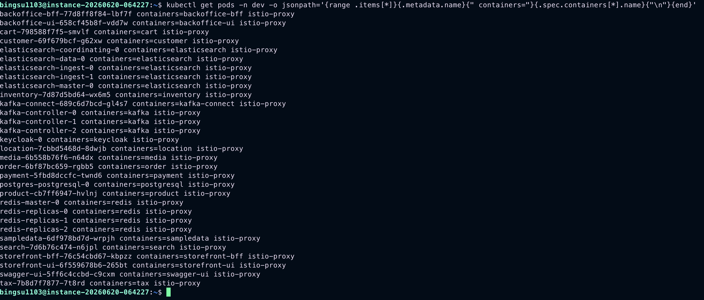

Caption: Pod trong namespace `dev` có cả container ứng dụng và container `istio-proxy`, chứng minh sidecar đã được inject.

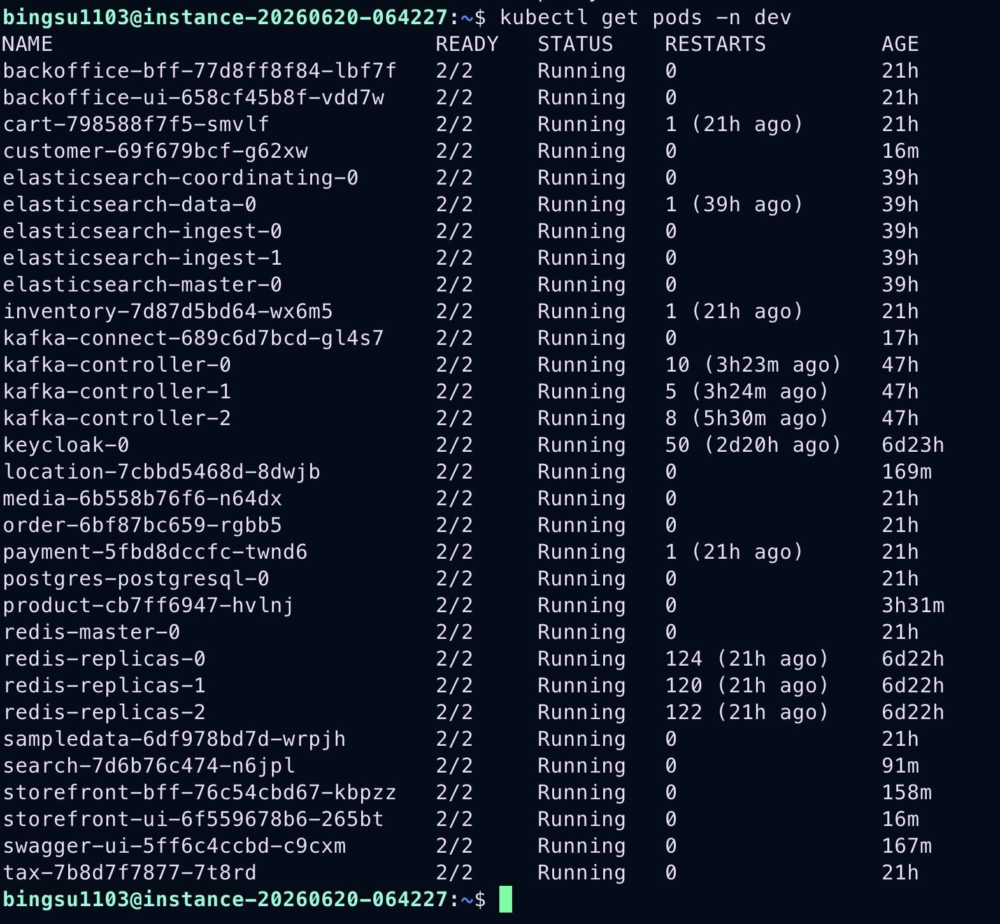

Caption: Các pod ứng dụng trong namespace `dev` ở trạng thái `2/2 Running`, nghĩa là workload và sidecar đều sẵn sàng.

## 4. mTLS STRICT

Lệnh kiểm chứng:

```bash
kubectl get peerauthentication -n dev
kubectl get destinationrule -n dev
kubectl describe peerauthentication dev-strict-mtls -n dev
```

Screenshot đã có:

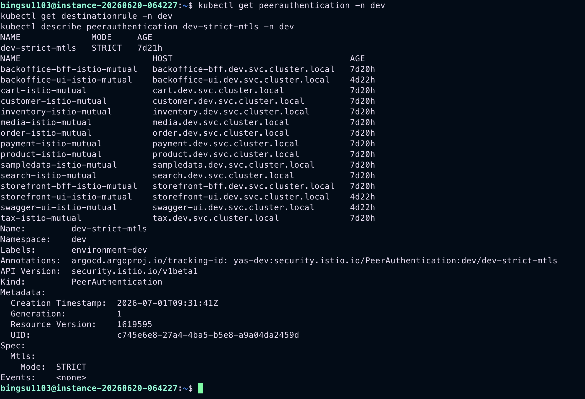

Caption: `PeerAuthentication dev-strict-mtls` bật mTLS `STRICT` cho namespace `dev`, đồng thời các `DestinationRule` cấu hình `ISTIO_MUTUAL` cho service trong scope.

Nội dung viết:

- Không dùng wildcard quá rộng để tránh ảnh hưởng infra.
- DestinationRule chỉ áp dụng cho service có sidecar.

## 5. Retry Policy

Lệnh kiểm chứng:

```bash
kubectl get virtualservice -n dev
kubectl describe virtualservice tax-retry -n dev
```

Screenshot đã có:

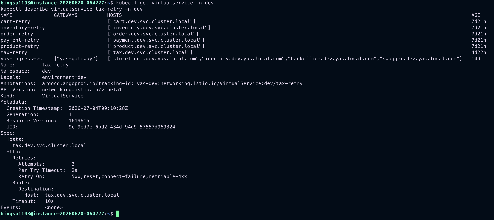

Caption: `VirtualService tax-retry` cấu hình `attempts=3`, `perTryTimeout=2s` và `retryOn` cho lỗi tạm thời.

Nội dung viết:

- Retry áp dụng cho các service quan trọng: `product`, `cart`, `order`, `tax`, `payment`, `inventory`.
- Mục tiêu là tăng khả năng chịu lỗi tạm thời trong service-to-service traffic.

## 6. AuthorizationPolicy

Lệnh kiểm chứng:

```bash
kubectl get authorizationpolicy -n dev
kubectl describe authorizationpolicy allow-to-payment -n dev
```

Minh chứng screenshot cho phần này được gộp ở mục 7 để tránh lặp ảnh: ảnh `08-authz-allow-deny-curl-test.png` vừa thể hiện danh sách `AuthorizationPolicy`, vừa thể hiện kết quả allow/deny bằng `curl`.

## 7. Test Allow/Deny

Lệnh test:

```bash
kubectl run curl-allowed -n dev --image=curlimages/curl:8.8.0 --restart=Never \
  --overrides='{"spec":{"serviceAccountName":"storefront-bff","containers":[{"name":"curl","image":"curlimages/curl:8.8.0","command":["sleep","120"]}]}}'

kubectl run curl-denied -n dev --image=curlimages/curl:8.8.0 --restart=Never \
  --overrides='{"spec":{"serviceAccountName":"search","containers":[{"name":"curl","image":"curlimages/curl:8.8.0","command":["sleep","120"]}]}}'

kubectl wait --for=condition=Ready pod/curl-allowed pod/curl-denied -n dev --timeout=120s

kubectl exec -n dev curl-allowed -c curl -- \
  curl -s -o /tmp/out -w '%{http_code}\n' \
  http://product.dev.svc.cluster.local:8080/product/actuator/health

kubectl exec -n dev curl-denied -c curl -- \
  curl -s -o /tmp/out -w '%{http_code}\n' \
  http://payment.dev.svc.cluster.local:8081/payment/actuator/health
```

Kết quả đã kiểm chứng:

- `storefront-bff` SA -> `product`: `200`
- `search` SA -> `payment`: `403 RBAC: access denied`

Screenshot đã có:

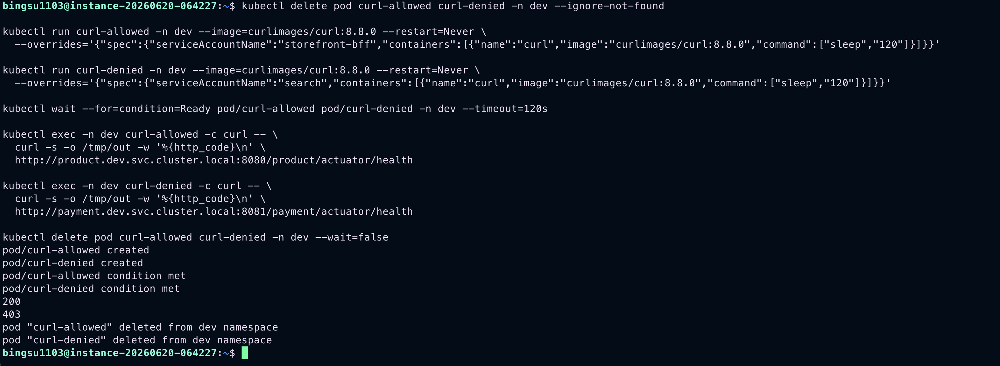

Caption: Namespace `dev` có `AuthorizationPolicy` kiểm soát traffic vào workload; request hợp lệ trả về `200`, trong khi request không hợp lệ từ ServiceAccount `search` tới `payment` bị chặn với `403 RBAC: access denied`.

## 8. Kiali Visualization

Mở Kiali:

```bash
kubectl port-forward -n istio-system svc/kiali 20001:20001
```

Truy cập:

```text
http://localhost:20001
```

Screenshot đã có:

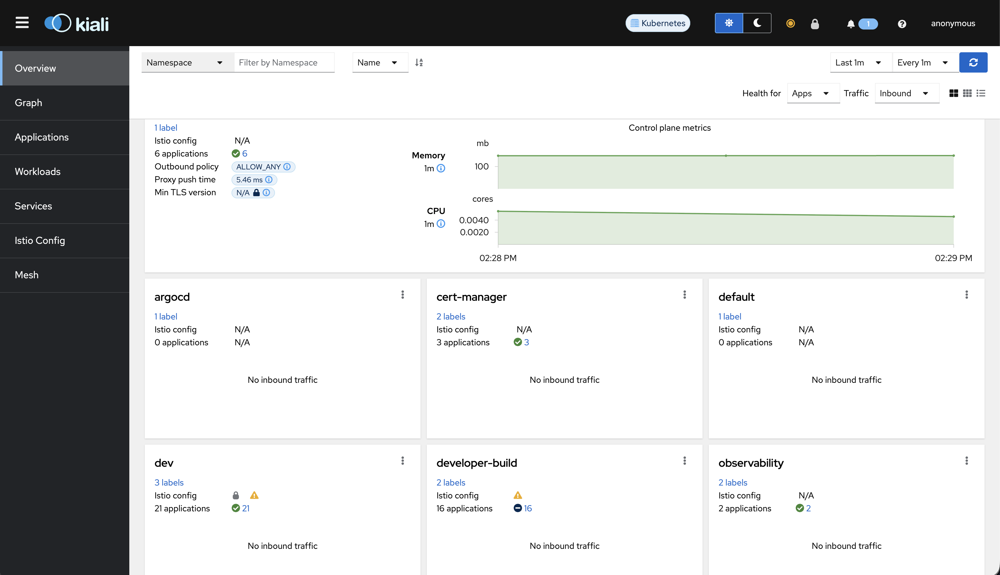

Caption: Kiali Overview hiển thị các namespace trong mesh và trạng thái tổng quan của môi trường.

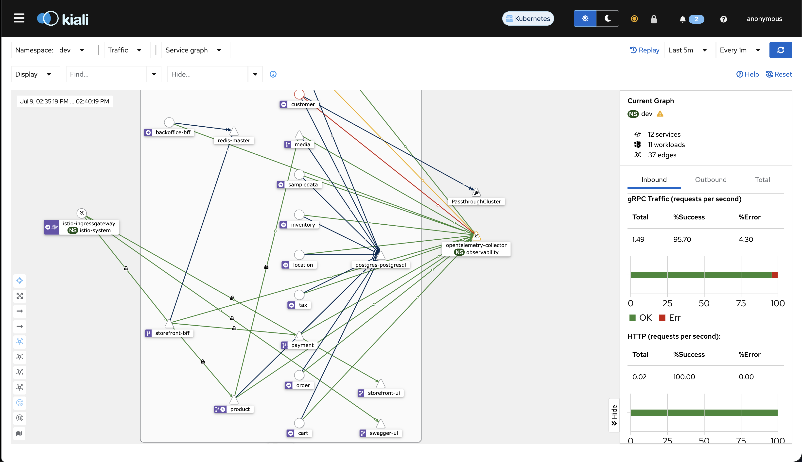

Caption: Kiali Service Graph trong namespace `dev` thể hiện topology traffic giữa các service, có biểu tượng lock cho kết nối mTLS và panel metrics để quan sát request/error.

## 9. Ingress Demo

Lệnh kiểm chứng:

```bash
kubectl port-forward -n istio-system svc/istio-ingressgateway 18080:80

curl -H 'Host: storefront.dev.yas.local.com' http://127.0.0.1:18080/
curl -H 'Host: swagger.dev.yas.local.com' http://127.0.0.1:18080/swagger-ui/
curl -H 'Host: storefront.dev.yas.local.com' http://127.0.0.1:18080/api/product/storefront/categories
curl -H 'Host: storefront.dev.yas.local.com' http://127.0.0.1:18080/api/payment/storefront/payment-providers
```

Kết quả đã kiểm chứng:

- Storefront trả về HTML có title `Yas - Storefront`, chứng minh route frontend qua ingress hoạt động.
- Swagger trả về HTML `Swagger UI`, chứng minh route tài liệu API qua ingress hoạt động.
- Product categories trả về JSON danh mục sản phẩm, chứng minh route API `product` qua ingress hoạt động.
- Payment providers trả về `[]`, chứng minh route API `payment` qua ingress hoạt động dù hiện chưa có provider dữ liệu.

Screenshot đã có:

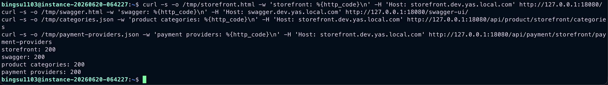

Caption: Các endpoint chính truy cập qua Istio ingress đều trả về HTTP `200`, gồm Storefront, Swagger UI, Product categories và Payment providers.

Lệnh đã dùng để screenshot dễ đọc hơn:

```bash
curl -s -o /tmp/storefront.html -w 'storefront: %{http_code}\n' -H 'Host: storefront.dev.yas.local.com' http://127.0.0.1:18080/
curl -s -o /tmp/swagger.html -w 'swagger: %{http_code}\n' -H 'Host: swagger.dev.yas.local.com' http://127.0.0.1:18080/swagger-ui/
curl -s -o /tmp/categories.json -w 'product categories: %{http_code}\n' -H 'Host: storefront.dev.yas.local.com' http://127.0.0.1:18080/api/product/storefront/categories
curl -s -o /tmp/payment-providers.json -w 'payment providers: %{http_code}\n' -H 'Host: storefront.dev.yas.local.com' http://127.0.0.1:18080/api/payment/storefront/payment-providers
```

## 10. Kết Luận

Kết luận cần nêu:

- `dev` đã có Service Mesh đầy đủ.
- mTLS, retry và AuthorizationPolicy đã được quản lý bằng GitOps.
- Kiali cung cấp bằng chứng trực quan cho topology và security.
- `staging` hiện mới có ingress Istio; nếu muốn bật policy như `dev`, cần bổ sung overlay `environments/staging/istio`.
